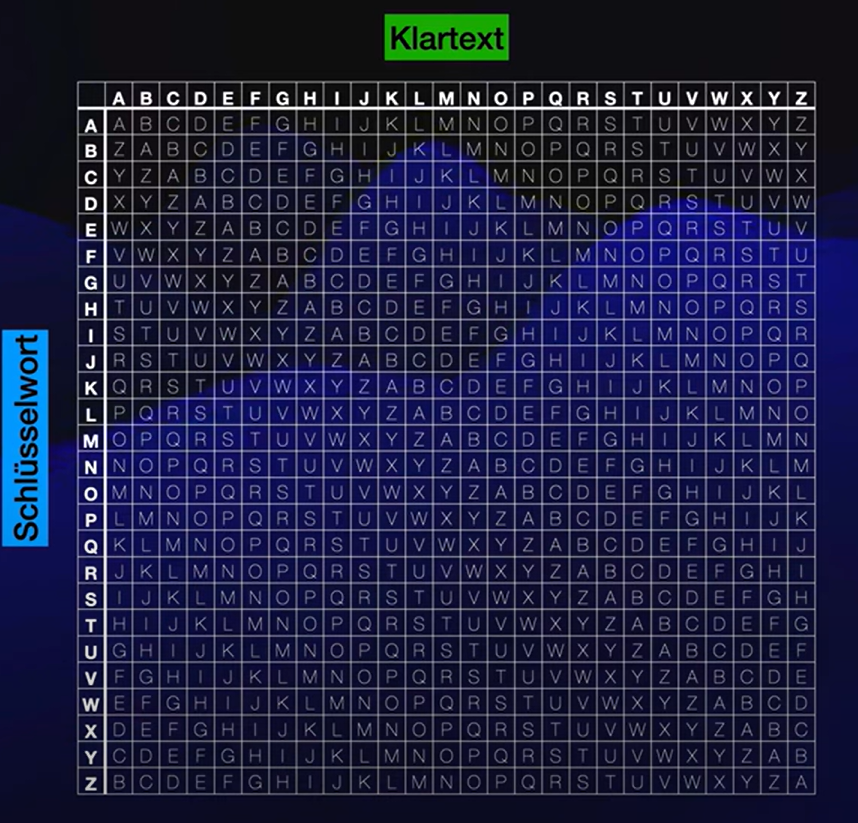

# m231

## Markdown Basics

- **#** Überschrift  
- *kursiv*, **fett**  
- `code` für Inline-Code  
- ``` ``` für Codeblöcke  
- Listen: `-`, `1.`  
- Links: `[Text](URL)`  
- Bilder: ``  

---

# Lernjournal Tag 1
## Schweizer Datenschutzgesetz (DSG) – Leseauftrag

### 1. Inkrafttreten
- Neues DSG: **1. September 2023**  
- Keine Übergangsfrist – Pflichten sofort gültig.  

### 2. Vertreterpflicht für Verantwortliche im Ausland
Ein Schweiz-Vertreter ist zu benennen, wenn:  
- Datenbearbeitung im Zusammenhang mit **Angebot von Waren/Dienstleistungen in der Schweiz** oder **Überwachung von Verhalten** in der Schweiz steht,  
- Verarbeitung **umfangreich**,  
- **regelmäßig**,  
- mit **hohem Risiko** für Persönlichkeitsrechte verbunden ist.  

---

### 3. Ausnahmen von der Vertreterpflicht
- **Öffentliche Stellen/Behörden**  
- **Auftragsbearbeiter**
- **Private Verantwortliche** sind nur ausgenommen, wenn all ihre Datenbearbeitungen gelegentlich, nicht umfangreich und risikolos sind.
- **EDÖB** im Einzelfall eine Vertretung anordnen kann.

---

### 4. Anforderungen an einen Schweiz-Vertreter
Ein geeigneter Vertreter sollte:  
- Kenntnisse in **DSG, DSV, VDSZ** besitzen,  
- **DSGVO**-Kenntnisse haben,  
- **IT- und Datensicherheitskompetenz** mitbringen,  
- Erfahrung in der **Umsetzung gesetzlicher Vorgaben** vorweisen,  
- Umgang mit **EDÖB und Betroffenen** beherrschen,  
- in den **Amtssprachen der Schweiz** kommunizieren können.  

---

### 5. Aufgaben gemäß Artikel 15 DSG
- **Verzeichnis der Bearbeitungstätigkeiten** führen (Art. 12 Abs. 2 DSG).  
- **EDÖB** auf Anfrage Auskünfte geben.  
- **Betroffene Personen** über ihre Rechte informieren.  

---

### 6. Haftung bei Datenschutzverstößen
- **Verantwortlicher haftet im Außenverhältnis** (gegenüber Betroffenen & Behörden).  
- Schweiz-Vertreter haftet **nicht im Außenverhältnis**.  
- **Innenverhältnis**: Haftung kann vertraglich geregelt sein.  

---

### 7. Obligationenrecht (OR)
- Vertragliche Beziehung nach **Art. 394 ff. OR (Auftragsrecht)**.  
- Pflichten: **Sorgfalt**, **Treue**, **organisatorische Fähigkeit**.  

---

### 8. Bedeutung für die Reputation
- Fachlich & sprachlich geeigneter Vertreter =  
  - **Rechtssichere Kommunikation** mit Behörden und Betroffenen,  
  - Stärkung von **Vertrauen und Compliance**,  
  - **Positives Unternehmensimage**.  

---
# Datensicherheit und Datenschutz 


# Lizenzmodelle

## Was ist eine Lizenz?
- Eine Lizenz ist die Erlaubnis, etwas zu nutzen, z. B. Software.  
- Sie schützt Rechte und regelt, wer etwas benutzen darf und unter welchen Bedingungen.  
- Lizenzen gibt es für Musik, Filme, Bücher, Patente, Fotos oder Apps. Beispiel: Kauf einer Pro-Version einer App.

## Arten von Lizenzen

- **Perpetual License (Dauerlizenz)**  
  Einmalige Zahlung für die dauerhafte Nutzung der Software.  
  *Beispiel:* Videospiel kaufen.

- **Subscription License (Abonnementlizenz)**  
  Regelmäßige Zahlungen (monatlich oder jährlich) für die Nutzung der Software.  
  *Beispiel:* Quizlet Plus.

- **Concurrent License (Gleichzeitige Nutzung)**  
  Mehrere Nutzer können gleichzeitig auf die Software zugreifen; Anzahl der Nutzer ist begrenzt.  
  *Beispiel:* Spotify Family.

- **Floating License (Schwimmende Lizenz)**  
  Lizenzen werden dynamisch zwischen Nutzern vergeben, abhängig von der Verfügbarkeit.  
  *Beispiel:* Keine konkrete Angabe.

- **Feature-Based License (Funktionsbasierte Lizenz)**  
  Nutzer zahlen nur für die Funktionen, die sie tatsächlich benötigen.  
  *Beispiel:* Microsoft 365 Apps (nur ausgewählte Apps).

- **Cloud-Based License (Cloudbasierte Lizenz)**  
  Nutzung über das Internet, oft im Abonnementmodell.  
  *Beispiel:* Canva.

- **Enterprise License (Unternehmenslizenz)**  
  Lizenz für ein ganzes Unternehmen, oft mit flexiblen Nutzungsrechten.  
  *Beispiel:* Microsoft 365 Enterprise.

- **Trialware (Testversion)**  
  Kostenlose Testversion für eine begrenzte Zeit oder mit eingeschränkten Funktionen.  
  *Beispiel:* Quizlet Plus Testversion.

## Open Source
Open Source bedeutet, dass jeder die Software benutzen, verändern und weitergeben kann, da der Quellcode offen ist.  
*Beispiel:* Bauplan einer Webseite, App oder Software.

## Rechte und Nutzung

- **Copyright**  
  Nur der Urheber darf die Nutzung bestimmen. Am häufigsten verwendet.

- **Copyleft**  
  Software darf frei genutzt und verändert werden, Änderungen müssen ebenfalls frei bleiben.

# Lernjournal Tag 3 
## Informationssicherheits-Dreieck

Drei Schutzziele:  

1. **Verfügbarkeit** – Daten und Systeme müssen jederzeit erreichbar sein.  
2. **Integrität** – Daten dürfen nicht unbemerkt verändert werden.  
3. **Vertraulichkeit** – Daten dürfen nur von Berechtigten eingesehen werden.  

Alle drei müssen im Gleichgewicht stehen.  
# Lernjournal Tag 4

## Mermaid:

### Beispiel:
mermaid
graph TD;
  A-->B;
  A-->C;
  B-->D;
  C-->D;


## Authentifizierung:
```mermaid
mindmap
  root((Authentifizierung))
    Definition
      Identifizierung
      Authentifizierung
      Autorisierung
    Faktoren
      Wissen
        Passwort
        PIN
      Besitz
        Token
        Smartcard
        Smartphone
      Sein
        Fingerabdruck
        Gesichtserkennung
        Iris-Scan
    Verfahren
      Einfaktor
      Zwei-Faktor (2FA)
      Multi-Faktor (MFA)
    Beispiele
      Login am PC
      Online-Banking
      Smartphone-Entsperrung
    Trends
      Passkeys
      FIDO2
      Biometrie
  ```

## Caesar Verschlüsselung (Beispiel mit +3)

| Klartext | Position | Verschoben (+3) | Geheimtext |
|----------|----------|-----------------|------------|
| A        | 0        | 3               | D          |
| B        | 1        | 4               | E          |
| C        | 2        | 5               | F          |
| X        | 23       | 26 → 0          | A          |
| Y        | 24       | 27 → 1          | B          |
| Z        | 25       | 28 → 2          | C          |

---

## Erklärung

Die Caesar-Verschlüsselung ist ein sehr einfaches Verfahren, bei dem jeder Buchstabe im Alphabet um eine feste Anzahl von Stellen verschoben wird.  
Im Beispiel oben haben wir den **Schlüssel +3** gewählt.  

**Beispiel:**
- Das bedeutet: **A → D, B → E, C → F, ... , X → A, Y → B, Z → C**.  
- Nach **Z** springt man also wieder am Anfang des Alphabets weiter.

### Verschlüsseln
Zum Verschlüsseln verschiebt man einfach jeden Buchstaben des Klartextes z.B. um 3 Stellen nach rechts im Alphabet.  
**Beispiel:**  
HALLO → KDOOR

### Entschlüsseln
Um den Text wieder lesbar zu machen, verschiebt man die Buchstaben einfach **3 Stellen zurück** (also in die entgegengesetzte Richtung).  
**Beispiel:**  
KDOOR → HALLO

- So kann man Nachrichten mit einem festen Schlüssel ganz leicht hin- und herwandeln. Das funktioniert aber nur, wenn die andere Person den Schlüssel kennt.  
- Allerdings ist die Caesar-Verschlüsselung nicht besonders sicher, da es nur **26 mögliche Schlüssel** gibt.  Jemand könnte also einfach alle Varianten ausprobieren.  

- Ein schneller Trick zum Entschlüsseln ist außerdem die **Häufigkeitsanalyse**: Da im Deutschen der Buchstabe **E** am häufigsten vorkommt, kann man den am häufigsten vorkommenden Buchstaben im Geheimtext nehmen und zurückrechnen, so hat man den Schlüssel oft schon sehr schnell gefunden.


## Vigenère-Verschlüsselung

### Vorgangsweise Beispiel:

  1. Klartext: z.B. Informatik Yeah
  2. Schlüsselwort: z.B. SPION
  3. Schlüsselwort an Klartext anpassen
- Klartext : I N F O R M A T I K Y E A H
- Schlüssel: S P I O N S P I O N S P I O



| Klartext | I | N | F | O | R | M | A | T | I | K |   | Y | E | A | H |
|------------|---|---|---|---|---|---|---|---|---|---|---|---|---|---|---|
| Schlüssel | S | P | I | O | N | S | P | I | O | N |   | S | P | I | O |
| Geheimtext| Q | Y | X | A | E | U | L | L | U | X |   | G | P | S | T |
---
| Geheimtext | Q | Y | X | A | E | U | L | L | U | X |   | G | P | S | T |
|------------|---|---|---|---|---|---|---|---|---|---|---|---|---|---|---|
| Schlüssel  | S | P | I | O | N | S | P | I | O | N |   | S | P | I | O |
| Klartext   | I | N | F | O | R | M | A | T | I | K |   | Y | E | A | H |
---

## Hash(Funktion)

### Was ist eine Hashfunktion?
Eine Hashfunktion erzeugt aus einer Eingabe (z. B. Datei, Text) einen **digitalen Code** fester Länge. Rechenfunktion, die Eingabe (z. B. Text, Datei) in festen „Fingerabdruck“ umwandelt.


Eigenschaften:
- Gleiche Eingabe=gleicher Hashwert  
- Sehr schnell berechenbar  
- Nicht umkehrbar (Einwegfunktion)  
- Schon kleine Änderungen=komplett anderer Hash  
- Es gibt verschiedene Hash-Algorithmen, z. B. SHA-512, SHA-256 oder MD5.

### PowerShell Beispiel
```powershell
(Get-FileHash "C:\Users\phili\Downloads\csvExample" -Algorithm SHA512).Hash
```
- Get-FileHash: berechnet den Hash einer Datei

- -Algorithm SHA512: nutzt den SHA-512 Algorithmus

- .Hash: zeigt nur den Hashwert

- Ausgabe-Beispiel: 67796EE19403E5D161F8CC5E686F663F9493F4CDD77CBD23AF03BB941D18BFEA83D1964DEC2BEA99FB6F4F5E167732A4D16267B701ED183DD6ACE1993485


### Wofür?

- Integritätsprüfung (Datei unverändert?)

- Passwortspeicherung (statt Klartext)

- Sicherheit im Internet (z. B. Zertifikate)
# Lernjournal Tag 5

## Schweizer Datenschutzgesetz und internationale Bezüge

### EMRK (Europäische Menschenrechtskonvention)
- **Art. 8 EMRK**: Recht auf Achtung des Privat- und Familienlebens.  
- Grundstein für Datenschutz in Europa.  
- Schweiz ist verpflichtet, diese Rechte zu respektieren.  

### DSGVO (EU-Datenschutz-Grundverordnung)
- EU-weit gültig seit 2018.  
- Sehr strenge Regeln zum Schutz von personenbezogenen Daten.  
- Prinzipien: Transparenz, Datenminimierung, Zweckbindung, Recht auf Vergessenwerden.  
- **Einfluss auf die Schweiz**: Da viele Unternehmen mit der EU handeln, muss die Schweiz ein „angemessenes Datenschutzniveau“ haben → sonst Probleme bei Datentransfers.  

### nDSG (neues Schweizer Datenschutzgesetz, 2023)
- In Kraft seit **1. September 2023**.  
- Anpassung an die DSGVO, aber weniger streng.  
- Fokus: Stärkung der Rechte von Betroffenen, Transparenz, Pflicht zur Datenschutz-Folgenabschätzung.  

### EDÖB (Eidgenössischer Datenschutz- und Öffentlichkeitsbeauftragter)
- Kontrollinstanz für die Einhaltung des Datenschutzes in der Schweiz.  
- Aufgaben:  
  - Beratung von Bürgern, Firmen und Behörden.  
  - Kontrolle und Untersuchungen bei Datenschutzverletzungen.  
  - Öffentlichkeitsarbeit und Empfehlungen.  
---

## Datenschutz vs. Datensicherheit

- **Datenschutz**: Schutz personenbezogener Daten (Wer darf was mit meinen Daten machen?).  
- **Datensicherheit**: Schutz aller Daten vor Verlust, Manipulation, unberechtigtem Zugriff.  

Beispiel:  
- DSG = Gesetz, das den Datenschutz regelt.  
- Firewall/Backup = Maßnahmen zur Datensicherheit.  

---

## Cookies und Dark Patterns

### Cookies
- Kleine Textdateien, die im Browser gespeichert werden.  
- Arten:  
  - **Session-Cookies**: nur während der Sitzung.  
  - **Persistent-Cookies**: bleiben gespeichert (z. B. Login merken).  
  - **Third-Party-Cookies**: von externen Diensten (z. B. Werbung, Tracking).  

### Dark Patterns
- Tricks im Webdesign, die Nutzer zu ungewollten Aktionen verleiten.  
- Beispiele:  
  - „Alles akzeptieren“-Button groß, Ablehnen versteckt.  
  - Automatisch angehakte Newsletter-Felder.  
  - Countdown-Timer für künstliche Dringlichkeit.  

---
