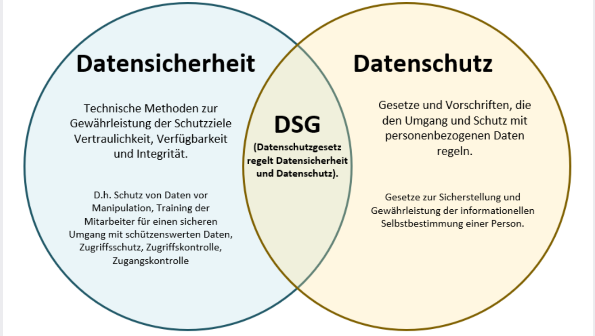
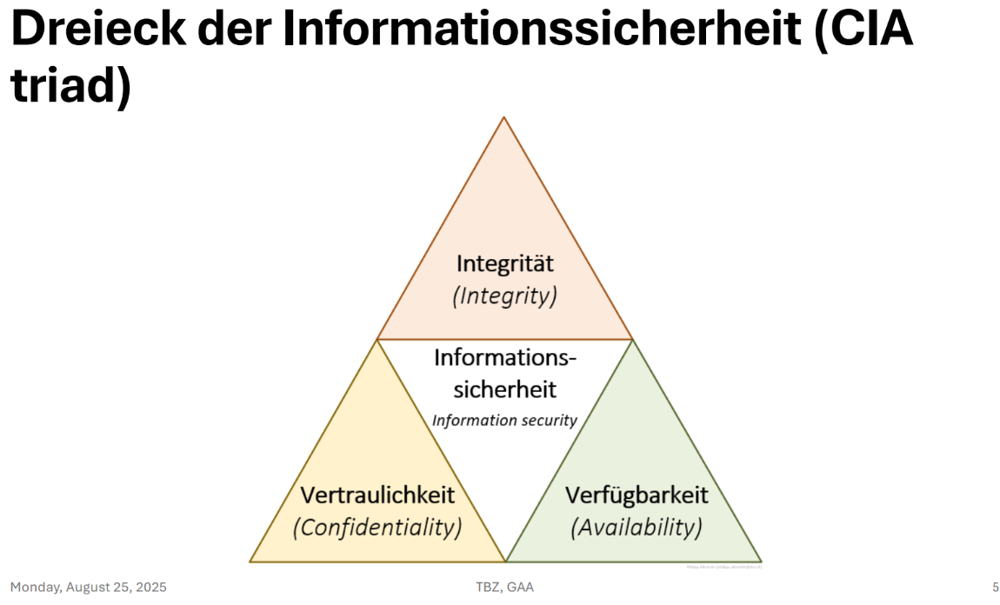

# m231

# Lernjournal Tag 1

## Deepfake
[Recherche über Deepfake](https://www.netzwoche.ch/news/2022-03-18/deepfake-video-gaukelt-kapitulierenden-ukrainischen-praesidenten-vor) so wie eine [Powerpoint über Deepfake](https://tbzedu-my.sharepoint.com/:p:/r/personal/lionel_schultze_edu_tbz_ch/Documents/Deepfakes.pptx?d=wbed84a56376d44698452a018ebabc099&csf=1&web=1&e=RSygYo)

## Schweizer Datenschutzgesetz (DSG) – Leseauftrag

### Inhaltsverzeichnis
1. [Inkrafttreten](#1-inkrafttreten)  
2. [Vertreterpflicht für Verantwortliche im Ausland](#2-vertreterpflicht-für-verantwortliche-im-ausland)  
3. [Ausnahmen von der Vertreterpflicht](#3-ausnahmen-von-der-vertreterpflicht)  
4. [Anforderungen an einen Schweiz-Vertreter](#4-anforderungen-an-einen-schweiz-vertreter)  
5. [Aufgaben gemäß Artikel 15 DSG](#5-aufgaben-gemäß-artikel-15-dsg)  
6. [Haftung bei Datenschutzverstößen](#6-haftung-bei-datenschutzverstößen)  
7. [Obligationenrecht (OR)](#7-obligationenrecht-or)  
8. [Bedeutung für die Reputation](#8-bedeutung-für-die-reputation)  

---

### 1. Inkrafttreten
- Neues DSG: **1. September 2023**  
- Keine Übergangsfrist – Pflichten sofort gültig.  

### 2. Vertreterpflicht für Verantwortliche im Ausland
Ein Schweiz-Vertreter ist zu benennen, wenn:  
- Datenbearbeitung im Zusammenhang mit **Angebot von Waren/Dienstleistungen in der Schweiz** oder **Überwachung von Verhalten** in der Schweiz steht,  
- Verarbeitung **umfangreich**,  
- **regelmäßig**,  
- mit **hohem Risiko** für Persönlichkeitsrechte verbunden ist.  

---

### 3. Ausnahmen von der Vertreterpflicht
- **Öffentliche Stellen/Behörden**  
- **Auftragsbearbeiter**
- **Private Verantwortliche** sind nur ausgenommen, wenn all ihre Datenbearbeitungen gelegentlich, nicht umfangreich und risikolos sind.
- **EDÖB** im Einzelfall eine Vertretung anordnen kann.

---

### 4. Anforderungen an einen Schweiz-Vertreter
Ein geeigneter Vertreter sollte:  
- Kenntnisse in **DSG, DSV, VDSZ** besitzen,  
- **DSGVO**-Kenntnisse haben,  
- **IT- und Datensicherheitskompetenz** mitbringen,  
- Erfahrung in der **Umsetzung gesetzlicher Vorgaben** vorweisen,  
- Umgang mit **EDÖB und Betroffenen** beherrschen,  
- in den **Amtssprachen der Schweiz** kommunizieren können.  

---

### 5. Aufgaben gemäß Artikel 15 DSG
- **Verzeichnis der Bearbeitungstätigkeiten** führen (Art. 12 Abs. 2 DSG).  
- **EDÖB** auf Anfrage Auskünfte geben.  
- **Betroffene Personen** über ihre Rechte informieren.  

---

### 6. Haftung bei Datenschutzverstößen
- **Verantwortlicher haftet im Außenverhältnis** (gegenüber Betroffenen & Behörden).  
- Schweiz-Vertreter haftet **nicht im Außenverhältnis**.  
- **Innenverhältnis**: Haftung kann vertraglich geregelt sein.  

---

### 7. Obligationenrecht (OR)
- Vertragliche Beziehung nach **Art. 394 ff. OR (Auftragsrecht)**.  
- Pflichten: **Sorgfalt**, **Treue**, **organisatorische Fähigkeit**.  

---

### 8. Bedeutung für die Reputation
- Fachlich & sprachlich geeigneter Vertreter =  
  - **Rechtssichere Kommunikation** mit Behörden und Betroffenen,  
  - Stärkung von **Vertrauen und Compliance**,  
  - **Positives Unternehmensimage**.  

---
# Datensicherheit und Datenschutz 


# Lizenzmodelle

## Was ist eine Lizenz?
- Eine Lizenz ist die Erlaubnis, etwas zu nutzen, z. B. Software.  
- Sie schützt Rechte und regelt, wer etwas benutzen darf und unter welchen Bedingungen.  
- Lizenzen gibt es für Musik, Filme, Bücher, Patente, Fotos oder Apps. Beispiel: Kauf einer Pro-Version einer App.

## Arten von Lizenzen

- **Perpetual License (Dauerlizenz)**  
  Einmalige Zahlung für die dauerhafte Nutzung der Software.  
  *Beispiel:* Videospiel kaufen.

- **Subscription License (Abonnementlizenz)**  
  Regelmäßige Zahlungen (monatlich oder jährlich) für die Nutzung der Software.  
  *Beispiel:* Quizlet Plus.

- **Concurrent License (Gleichzeitige Nutzung)**  
  Mehrere Nutzer können gleichzeitig auf die Software zugreifen; Anzahl der Nutzer ist begrenzt.  
  *Beispiel:* Spotify Family.

- **Floating License (Schwimmende Lizenz)**  
  Lizenzen werden dynamisch zwischen Nutzern vergeben, abhängig von der Verfügbarkeit.  
  *Beispiel:* Keine konkrete Angabe.

- **Feature-Based License (Funktionsbasierte Lizenz)**  
  Nutzer zahlen nur für die Funktionen, die sie tatsächlich benötigen.  
  *Beispiel:* Microsoft 365 Apps (nur ausgewählte Apps).

- **Cloud-Based License (Cloudbasierte Lizenz)**  
  Nutzung über das Internet, oft im Abonnementmodell.  
  *Beispiel:* Canva.

- **Enterprise License (Unternehmenslizenz)**  
  Lizenz für ein ganzes Unternehmen, oft mit flexiblen Nutzungsrechten.  
  *Beispiel:* Microsoft 365 Enterprise.

- **Trialware (Testversion)**  
  Kostenlose Testversion für eine begrenzte Zeit oder mit eingeschränkten Funktionen.  
  *Beispiel:* Quizlet Plus Testversion.

## Open Source
Open Source bedeutet, dass jeder die Software benutzen, verändern und weitergeben kann, da der Quellcode offen ist.  
*Beispiel:* Bauplan einer Webseite, App oder Software.

## Rechte und Nutzung

- **Copyright**  
  Nur der Urheber darf die Nutzung bestimmen. Am häufigsten verwendet.


- **Copyleft**  
  Software darf frei$ genutzt und verändert werden, Änderungen müssen ebenfalls frei bleiben.

# Lernjournal Tag 3 


## Repetition, Lizenzen

**Gut gemacht:** Ich habe mich aktiv beteiligt und mich bei schwierigeren Themen nicht entmutigen lassen hast! Besonders bei den Lizenzmodellen und den verschiedenen Anwendungsbereichen von Lizenzen habe ich klar gezeigt, dass ich darauf reagieren kann, wenn ich mehr Informationen bekomme.


### Verbesserungen

1. **Präzision in meinen Erklärungen**: Weniger auf Beispiele angewiesen zu sein, und klar erklären, was ein Begriff bedeutet. Ich könnte mir angewöhnen, bei einer Definition zu fragen: "Was ist das Grundlegende, das dieser Begriff beschreibt?"

2. **Unterschiede herausarbeiten**: Besonders beim Vergleich von "copyright" und "copyleft" sollte ich genauer darauf achten, was tatsächlich ähnlich oder anders ist. Ich notiere mir vielleicht Stichpunkte, um solche Unterschiede besser im Kopf zu behalten.

3. **Begriffe durchdenken**: Bei schwierigen Worten wie "open source" ist es hilfreich, mir zu überlegen: "Was macht das besonders? Was ist der Kern dieses Begriffs?" So komme ich schneller auf genauere Antworten.

## Checkliste Smartphone-Sicherheit erhöhen
- **Link:** https://www.datenschutz.ch/meine-daten-schuetzen/smartphone-sicherheit-erhoehen  

**01 Gerätesperre**  
- Ich habe meinen PIN/Face-ID drin, sperrt sich nach 2 Min.  

**02 Verlust**  
- Das musste ich schon mal machen, als ich mein Handy im Zug verlor.

**03 Apps**  
- Ich lade Apps nur aus dem App Store herunter.  

**04 WLAN**  
- Öffentliches WLAN, brauche ich kaum, da ich unbegrenztes Daten Volumen habe.  

**05 Updates**  
- Automatische Updates sind an.  

**06 Daten löschen**  
- Vor Weiterverkauf, werde ich sich mein Handy zurücksetzen.  

**07 Vorsicht**  
- Das ist mir schon lange bewusst und sehr wichtig für die Sicherheit meiner Daten und meines Handys.

**08 Schnittstellen**  
- Mir ist bewusst das ich Bluetooth & Ortung nur an haben sollte, wenn ich es brauche. Ich vergesse das aber oft abzuschalten.  

**09 Cloud**  
- Bei mir kommt das nicht sehr drauf an, da meine Familie 2 TB Cloud für alle hat, völlig genug für alle.  

**10 2FA**  
- Ich habe 2-Faktor bei Google & Insta aktiv und auch bei manchen Videospielen.


- ## PC-Sicherheit erhöhen – Checkliste für Windows
- **Link:** https://www.datenschutz.ch/meine-daten-schuetzen/pc-sicherheit-erhoehen-in-fuenf-schritten

**01 Updates**  
- Ich habe automatische Updates für Windows und Programme an.  

**02 Virenschutz und Firewall**  
- Ich habe den Windows Defender aktiviert.  
- Ich habe die Windows-Firewall eingeschaltet.  

**03 Starke Passwörter**  
- Ich habe für viele Accounts das selbe Passwort, jetzt möchte ich aber einen Passwortmanager machen.  

**04 Phishing**  
- Ich klicke keine Links oder Anhänge von Fremden an.  

**05 Browser sichern**  
- Ich habe mir jetzt Browser-Add-ons wie Adblock an und lösche regelmäßig den Cache.  

**06 Datenschutzfreundliche Dienste nutzen**
- Momentan möchte ich dies nicht machen, vielleicht mache ich das später.
  
**07 Backup**  
- Ich habe noch kein Backup gemacht, dies werde ich später machen. 

 **08 Daten verschlüsseln und löschen**
 - Ich habe dies noch nicht gemacht, das war mir gar nicht bewusst.
   
**09 Administratorkonto**  
- Ich bin mir nicht sicher, was für ein Konto ich habe. Dies werde ich nachher nachschauen.

**10 Unberechtigte Zugriffe verhindern**  
- Ich öffne keine unbekannten USB-Sticks oder Dateien von Fremden.

## Lesson Minecraft Education: Cyber Safe: Privacy Prodigy vermittelt:

Ich habe gelernt, wie wichtig es ist, meine Daten zu sichern und Aufgaben am richtigen Ort auszuführen. Außerdem habe ich erkannt, wie entscheidend es ist, fehlerhafte Daten zu löschen, zu vermeiden und falsch gespeicherte Daten an den richtigen Ort zu verschieben.

# Lernjournal Tag 4

## Mermaid:

### Beispiel:


## Authentifizierung:
```mermaid
mindmap
  root((Authentifizierung))
    Definition
      Identifizierung
      Authentifizierung
      Autorisierung
    Faktoren
      Wissen
        Passwort
        PIN
      Besitz
        Token
        Smartcard
        Smartphone
      Sein
        Fingerabdruck
        Gesichtserkennung
        Iris-Scan
    Verfahren
      Einfaktor
      Zwei-Faktor (2FA)
      Multi-Faktor (MFA)
    Beispiele
      Login am PC
      Online-Banking
      Smartphone-Entsperrung
    Trends
      Passkeys
      FIDO2
      Biometrie
  ```

## Caesar Verschlüsselung (Beispiel mit +3)

| Klartext | Position | Verschoben (+3) | Geheimtext |
|----------|----------|-----------------|------------|
| A        | 0        | 3               | D          |
| B        | 1        | 4               | E          |
| C        | 2        | 5               | F          |
| D        | 3        | 6               | G          |
| E        | 4        | 7               | H          |
| F        | 5        | 8               | I          |
| G        | 6        | 9               | J          |
| H        | 7        | 10              | K          |
| I        | 8        | 11              | L          |
| J        | 9        | 12              | M          |
| K        | 10       | 13              | N          |
| L        | 11       | 14              | O          |
| M        | 12       | 15              | P          |
| N        | 13       | 16              | Q          |
| O        | 14       | 17              | R          |
| P        | 15       | 18              | S          |
| Q        | 16       | 19              | T          |
| R        | 17       | 20              | U          |
| S        | 18       | 21              | V          |
| T        | 19       | 22              | W          |
| U        | 20       | 23              | X          |
| V        | 21       | 24              | Y          |
| W        | 22       | 25              | Z          |
| X        | 23       | 26 → 0          | A          |
| Y        | 24       | 27 → 1          | B          |
| Z        | 25       | 28 → 2          | C          |

---

## Erklärung

Die Caesar-Verschlüsselung ist ein sehr einfaches Verfahren, bei dem jeder Buchstabe im Alphabet um eine feste Anzahl von Stellen verschoben wird.  
Im Beispiel oben haben wir den **Schlüssel +3** gewählt.  

**Beispiel:**
- Das bedeutet: **A → D, B → E, C → F, ... , X → A, Y → B, Z → C**.  
- Nach **Z** springt man also wieder am Anfang des Alphabets weiter.

### Verschlüsseln
Zum Verschlüsseln verschiebt man einfach jeden Buchstaben des Klartextes z.B. um 3 Stellen nach rechts im Alphabet.  
**Beispiel:**  
HALLO → KDOOR

### Entschlüsseln
Um den Text wieder lesbar zu machen, verschiebt man die Buchstaben einfach **3 Stellen zurück** (also in die entgegengesetzte Richtung).  
**Beispiel:**  
KDOOR → HALLO

- So kann man Nachrichten mit einem festen Schlüssel ganz leicht hin- und herwandeln. Das funktioniert aber nur, wenn die andere Person den Schlüssel kennt.  
- Allerdings ist die Caesar-Verschlüsselung nicht besonders sicher, da es nur **26 mögliche Schlüssel** gibt.  Jemand könnte also einfach alle Varianten ausprobieren.  

- Ein schneller Trick zum Entschlüsseln ist außerdem die **Häufigkeitsanalyse**: Da im Deutschen der Buchstabe **E** am häufigsten vorkommt, kann man den am häufigsten vorkommenden Buchstaben im Geheimtext nehmen und zurückrechnen, so hat man den Schlüssel oft schon sehr schnell gefunden.


## Vigenère-Verschlüsselung

### Vorgangsweise Beispiel:

  1. Klartext: z.B. Informatik Yeah
  2. Schlüsselwort: z.B. SPION
  3. Schlüsselwort an Klartext anpassen
- Klartext : I N F O R M A T I K Y E A H
- Schlüssel: S P I O N S P I O N S P I O


| Klartext | I | N | F | O | R | M | A | T | I | K |   | Y | E | A | H |
| Schlüssel | S | P | I | O | N | S | P | I | O | N |   | S | P | I | O |
| Geheimtext| Q | Y | X | A | E | U | L | L | U | X |   | G | P | S | T |
---
| Geheimtext | Q | Y | X | A | E | U | L | L | U | X |   | G | P | S | T |
| Schlüssel  | S | P | I | O | N | S | P | I | O | N |   | S | P | I | O |
| Klartext   | I | N | F | O | R | M | A | T | I | K |   | Y | E | A | H |
---

## Hash(Funktion)

### Was ist eine Hashfunktion?
Eine Hashfunktion erzeugt aus einer Eingabe (z. B. Datei, Text) einen **digitalen Code** fester Länge.

Eigenschaften:
- Gleiche Eingabe=gleicher Hashwert  
- Sehr schnell berechenbar  
- Nicht umkehrbar (Einwegfunktion)  
- Schon kleine Änderungen=komplett anderer Hash  
- Es gibt verschiedene Hash-Algorithmen, z. B. SHA-512 oder MD5.

---

### PowerShell Beispiel
```powershell
(Get-FileHash "C:\Users\phili\Downloads\csvExample" -Algorithm SHA512).Hash
```
- Get-FileHash: berechnet den Hash einer Datei

- -Algorithm SHA512: nutzt den SHA-512 Algorithmus

- .Hash: zeigt nur den Hashwert

- Ausgabe-Beispiel: 67796EE19403E5D161F8CC5E686F663F9493F4CDD77CBD23AF03BB941D18BFEA83D1964DEC2BEA99FB6F4F5E167732A4D16267B701ED183DD6ACE1993485


### Wofür?

- Integritätsprüfung (Datei unverändert?)

- Passwortspeicherung (statt Klartext)

- Sicherheit im Internet (z. B. Zertifikate)
